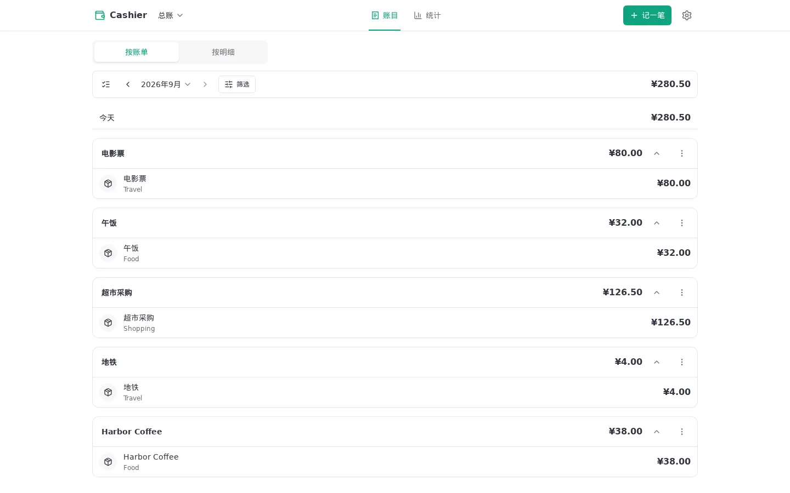
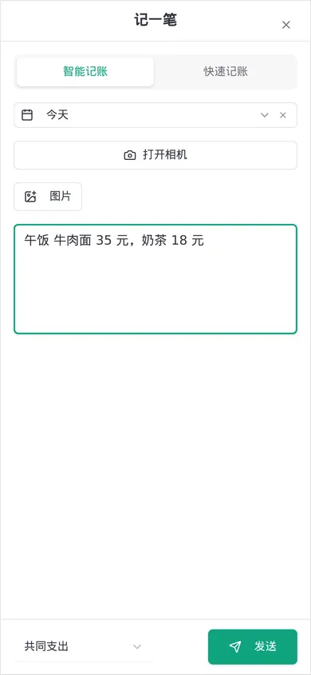

# Cashier

> 把小票、发票和一句话，变成可核对的个人账本。

[](https://github.com/Xiangyu-Labs/Cashier/actions/workflows/ci-cd.yml)
[](./LICENSE)



Cashier 最初只是我给自己做的记账工具：拍下小票，或者随手写一句“午饭 35 元”，剩下的整理工作交给 AI。
它是为实际在用的两个人写的。以 AGPL 发布，是为了让想要它的人可以 fork 过去改成自己的样子，而不是要把它
改得适合所有人。欢迎报告 bug；功能请求多半会得到"fork 吧，那样更适合你"的回答。

Cashier 会从图片或文字中提取日期、商家、金额、币种、分类和消费明细。AI 的结果不是不可触碰的黑盒：
你可以在入账前后检查、修改、重新处理，并在账目和统计中继续管理这些账单。

## 它能做什么

- 上传小票、发票图片，或直接输入自然语言记账
- 提取账单标题、日期、金额、币种、分类和明细
- 复核和编辑 AI 结果，处理识别失败的账单
- 管理多币种消费，并按账本主币种查看汇总；用分账把账目分开看，总账看全部
- 在账目里按账单或按明细回看、筛选，在统计图表里看支出的去向和走势
- 创建绑定分账的 API 密钥，供脚本、快捷指令和外部集成使用（见 [API v1](./docs/api.md)）
- 中文界面；AI 可以按设置用其他语言填写账单内容

<picture>
  <source media="(max-width: 600px)" srcset="./public/readme/entry-mobile.webp">
  
</picture>

## 使用前请知道

> **项目状态：早期公开版本**

- 这个项目源于个人使用，还没有正式稳定版或兼容性承诺。
- AI 可能误读票据或错误分类，重要账目请在入账后人工复核。
- 升级前请备份 PostgreSQL 数据库和对象存储。
- AI 解析需要联网，并依赖可用的 OpenAI 或 OpenAI 兼容接口。
- Cashier 是记账工具，不提供会计、税务或财务建议。

## 快速开始

需要 Node.js 24 和 Docker。

### Demo 工作区

最快的试用方式，不碰你的任何东西：不需要远程数据库、对象存储、认证服务、AI 密钥，也不读项目的 `.env`。

```bash
npm ci
npm run dev:demo
```

打开终端打印的本地地址，选择 `Continue as dev`。启动信息里列出了预置的示例 API 密钥，每个都标注了
它写入的分账。`docker-compose.demo.yml` 启动专用的 `cashier-demo` PostgreSQL 和对象存储，迁移
`cashier_demo` 数据库，并写入虚构的票据和历史；AI 由本地假服务代替，登录用 dev 旁路。每次启动都会先打印重建目标，
再把工作区恢复成初始数据，上一次的修改不会保留。

```bash
npm run demo:reset            # 只预览目标
npm run demo:reset -- --apply # 重建 dev@cashier.local 的专用数据
```

默认端口为应用 `3000`、PostgreSQL `55433`、对象存储 `59000`，可用 `CASHIER_DEMO_APP_PORT`、
`CASHIER_DEMO_POSTGRES_PORT`、`CASHIER_DEMO_S3_PORT` 覆盖。

### 连接真实服务

```bash
git clone https://github.com/Xiangyu-Labs/Cashier.git
cd Cashier
npm ci
cp .env.local.example .env
```

编辑 `.env`，填入 AI 密钥（`OPENAI_API_KEY`）。然后启动 PostgreSQL、对象存储和应用：

```bash
npm run docker:local
npm run db:migrate
npm run dev
```

账号、账本和分账不在环境变量或网页向导里配置，而是用本地命令创建：

```bash
npm run account:create -- --email you@example.com
npm run account:add-email -- --email other@example.com
```

- `account:create` 在一个事务里创建账号、登录邮箱、账本、分账（默认 `共同支出`，可用 `--book`
  多次指定）和默认分类；已有账号或邮箱已被使用时拒绝执行。
- `account:add-email` 给唯一的账号再绑定一个登录邮箱。平时在设置页的"登录邮箱"里增删即可；只有在认证服务里
  改了邮箱、导致没有人能登录时，才需要用这个命令兜底。

账号没有密码，登录完全交给认证服务（见下面的"登录（OIDC）"）。本地开发可以设置 `DEV_AUTH_BYPASS=true`，
在登录页直接以开发身份进入。

两个命令读取 `DATABASE_URL`（环境变量，或项目根目录的 `.env.local` / `.env`）。

不要提交 `.env`、服务商凭证、真实票据、API 密钥或原始个人数据。

## 配置

本地开发从 `.env.local.example` 开始；Docker 部署从 `.env.example` 开始。空字符串视为未配置。

### 应用与 AI

| 变量              | 必需 | 默认值                      | 说明                                                         |
| ----------------- | ---- | --------------------------- | ------------------------------------------------------------ |
| `APP_URL`         | 否   | `http://localhost:3000`     | 用户访问 Cashier 的公开地址。                                |
| `OPENAI_API_KEY`  | 是   | 无                          | OpenAI 或兼容服务的 API 密钥。                               |
| `OPENAI_BASE_URL` | 否   | `https://api.openai.com/v1` | OpenAI 兼容 API 根地址。                                     |
| `AI_MODEL`        | 否   | `gpt-4o`                    | 用于票据解析和分类的模型名。                                 |
| `TZ`              | 否   | `Asia/Shanghai`             | 服务端进程的时区。账本的日期按设置里的时区计算，不受它影响。 |

使用其他 OpenAI 兼容服务时，同时修改 `OPENAI_BASE_URL` 和 `AI_MODEL`。

### PostgreSQL

| 变量                | 必需 | 默认值 | 说明                                                                                                                            |
| ------------------- | ---- | ------ | ------------------------------------------------------------------------------------------------------------------------------- |
| `DATABASE_URL`      | 是   | 无     | 必须是 `postgres://` 或 `postgresql://` 地址。生产环境连非本机主机时必须写明 `sslmode`：`require`、`verify-full` 或 `disable`。 |
| `DATABASE_POOL_MAX` | 否   | `10`   | 连接池上限，范围 1–50。worker 和请求共用这个池。                                                                                |

`sslmode=disable` 是显式的选择，只适合数据库和应用在同一台机器的内部网络里（Docker compose 就是这样）。
没有写 `sslmode` 的非本机地址在生产环境会被拒绝，避免忘写时静默明文连接。

### S3 兼容对象存储

| 变量                   | 必需 | 默认值  | 说明                                                                              |
| ---------------------- | ---- | ------- | --------------------------------------------------------------------------------- |
| `S3_ENDPOINT`          | 是   | 无      | 服务端访问的 S3 兼容端点。浏览器从不直接访问对象存储。                            |
| `S3_REGION`            | 否   | `auto`  | 自建网关须与它的 `VGW_REGION` 一致（compose 里是 `auto`）；其他服务按供应商配置。 |
| `S3_BUCKET`            | 是   | 无      | 已经存在的私有存储桶名称。                                                        |
| `S3_ACCESS_KEY_ID`     | 是   | 无      | S3 访问密钥 ID。                                                                  |
| `S3_SECRET_ACCESS_KEY` | 是   | 无      | S3 访问密钥。                                                                     |
| `S3_FORCE_PATH_STYLE`  | 否   | `false` | Versity、MinIO 等自建服务通常需要设为 `true`。                                    |

### 认证与内部密钥

| 变量                 | 必需   | 默认值       | 说明                                                                     |
| -------------------- | ------ | ------------ | ------------------------------------------------------------------------ |
| `AUTH_SECRET`        | 运行时 | 本地模板提供 | 唯一的内部密钥，会话、登录过程的签名、API key 的密钥都由它派生。         |
| `OIDC_ISSUER_URL`    | 是     | 无           | OIDC 提供方的 issuer 地址。必须是 https；只有 loopback 地址可以用 http。 |
| `OIDC_CLIENT_ID`     | 是     | 无           | 在提供方里为 Cashier 注册的 client id。                                  |
| `OIDC_CLIENT_SECRET` | 是     | 无           | 对应的 client secret，用 `client_secret_basic` 发送。                    |
| `DEV_AUTH_BYPASS`    | 否     | `false`      | 仅测试环境，或 `APP_URL` 指向 loopback 的 development 环境可用。         |

`.env.local.example` 里的内部密钥是公开的固定开发值，只用于 loopback 环境复制后立即启动，
不能用于可被外部访问的部署。

### 日志与端口

| 变量        | 默认值 | 说明                                                        |
| ----------- | ------ | ----------------------------------------------------------- |
| `LOG_LEVEL` | `info` | 应用日志级别。                                              |
| `S3_PORT`   | `9000` | 本地开发用的对象存储暴露的端口（Docker 部署里不暴露端口）。 |

### 调参常量

重试次数、超时、图片质量这些数字不是环境变量，它们在 `src/config/tuning.ts` 里，
改一个数字然后重新部署即可。上传的单张原图最多 20 MiB、约 48 MP；一次提交归一化后的总量限制在 3 MiB（它约束
发给 AI 的载荷）。批量分类一次最多提交 5,000 条明细，同时只跑一个任务，同一账单每次 AI 请求最多包含 50 条明细。

## 部署（Docker）

Cashier 以一个常驻的 Node 进程运行在 Docker 里，和 PostgreSQL、S3 兼容的对象存储（Versity S3 Gateway）一起由 `compose.yaml` 编排。
后台提取、批量分类和每日维护都在应用进程内完成，不需要外部的定时任务或队列。

### 准备

```bash
cp .env.example .env
```

编辑 `.env`，至少填写：

- `CASHIER_HOST`：对外域名，例如 `cashier.example.com`。`APP_URL` 必须是 `https://<CASHIER_HOST>`，
  OIDC 的回调地址 `<APP_URL>/api/auth/callback` 由它决定；以后改域名要同步改认证服务里登记的回调地址。
- `POSTGRES_PASSWORD`、`S3_ACCESS_KEY_ID`、`S3_SECRET_ACCESS_KEY`：随机值，例如 `openssl rand -hex 24`。
- `OPENAI_API_KEY`（以及按需的 `OPENAI_BASE_URL`、`AI_MODEL`）。
- `OIDC_ISSUER_URL`、`OIDC_CLIENT_ID`、`OIDC_CLIENT_SECRET`：在认证服务里为 Cashier 注册 client 后得到，
  配置见下面的"登录（OIDC）"。
- `AUTH_SECRET`：安全随机值，在重启和升级之间保持一致。更换它会让所有会话和 API key 失效。
- `CASHIER_DATA_DIR`：数据库和对象存储的宿主机目录，默认 `./data`。

### 启动

```bash
docker compose up -d --build
```

应用容器的入口先在 advisory lock 下、一个事务里执行迁移，成功后才启动服务；迁移失败时容器退出，数据库保持原样。
Postgres 和对象存储只在 compose 的内部网络里，不占用宿主机端口。应用监听容器内的 3000 端口，由反向代理转发。

对象存储用 Versity S3 Gateway 的 posix 后端：存储桶是 `${CASHIER_DATA_DIR}/s3/` 下的目录，对象就是里面的文件，
所以数据目录的一个快照就是完整备份。数据目录所在的文件系统需要支持扩展属性（ext4、XFS、ZFS 都支持）。
没有用 MinIO，是因为它不再发布社区版镜像，`quay.io/minio` 上的旧镜像已经拉取不到。

创建账号和注册链接（命令在应用容器里执行，读取容器自己的环境变量）：

```bash
docker compose exec app npm run account:create -- --email you@example.com
```

### 登录（OIDC）

Cashier 通过 OIDC 授权码流程（带 PKCE）登录，认证服务可以是 Authelia 或任何标准的 OIDC 提供方。
认证服务里用户的邮箱与 Cashier 的"登录邮箱"一一对应：提供方返回的邮箱没有绑定在 Cashier 里，就不能使用。
没有本地会话时，Cashier 直接跳到认证服务；认证服务里已经登录时，用户只会看到一次很快的跳转。
退出登录只清除 Cashier 自己的会话，不会退出认证服务，并停在不自动跳转的登录页。

以 Authelia 为例，在它的配置里登记 Cashier（`client_secret` 用 Authelia 的哈希格式，`OIDC_CLIENT_SECRET` 填明文）：

```yaml
identity_providers:
  oidc:
    clients:
      - client_id: cashier
        client_name: Cashier
        client_secret: "$pbkdf2-sha512$…"
        public: false
        authorization_policy: two_factor
        consent_mode: implicit
        redirect_uris:
          - https://cashier.example.com/api/auth/callback
        scopes: [openid, email, profile]
        require_pkce: true
        pkce_challenge_method: S256
        token_endpoint_auth_method: client_secret_basic
```

`OIDC_ISSUER_URL` 是 Authelia 的公开地址（例如 `https://auth.example.com`）。邮箱取自 ID token 的 `email`，
没有时再向 userinfo 端点读取；提供方标明 `email_verified` 为 false 的邮箱会被拒绝。

**从旧的通行密钥 / 邮件验证码登录升级前**，先确认 Cashier 设置页里的登录邮箱与认证服务里的用户邮箱一致，
否则升级后没有人能登录。万一已经锁在外面，在服务器上补一个邮箱：

```bash
docker compose exec app npm run account:add-email -- --email you@example.com
```

升级会删除通行密钥、验证码和限流相关的表，迁移前请先备份。

### 反向代理

手机相机和 OIDC 回调都要求 HTTPS，所以应用前面必须有终止 TLS 的反向代理。`compose.yaml` 里带有 Traefik 的 labels，
并让应用加入外部网络 `server-internal-net`（Traefik 所在的网络）；用别的反向代理时，删掉这些 labels 和那个网络，
自己转发到应用的 3000 端口。无论用哪种代理，都要满足：

- 保留原始的 `Host`（和 `X-Forwarded-Host`），并设置 `X-Forwarded-Proto: https`。否则登录和所有 server action
  会因为来源检查失败，会话 cookie 也会丢掉 `Secure`。
- 读超时至少几分钟：上传和 AI 请求都可能持续几十秒。
- 请求体上限不小于 32 MiB（API v1 的请求体上限）。

### 每日维护与后台工作

应用进程启动约 30 秒后补跑一次维护，之后每天 UTC 18:00（ECB 已发布当天汇率）运行一次：清理过期记录，刷新汇率，
清理没有被引用的文件和孤儿对象。每一步的结果写在日志里。容器停机期间错过的那次，会在下次启动时补上。
提取和批量分类由 worker 处理，提交后立即开始；容器重启时，没做完的工作在新进程里接着做。

收到停止信号（`docker compose stop`、重新部署）时，应用停止领取新工作，给手上的工作 20 秒完成，其余的交还队列，
由下一个进程接手。`stop_grace_period` 设为 30 秒。

对象存储没有需要手动运行的清理命令。维护总是先删记录再删对象：删对象失败只会留下没有记录的对象，
下一次再删，不会出现记录还在、对象却没了的情况。

## 升级、备份与恢复

升级前：

1. 备份 PostgreSQL 和对象存储的数据目录（`CASHIER_DATA_DIR` 下的 `postgres`、`s3`）。如果数据目录在 ZFS 上，
   先打一个快照最简单。
2. 记录当前部署的 Git 提交号。
3. 阅读目标版本的提交记录和迁移变化。

升级：

```bash
git pull
docker compose up -d --build
```

compose 会先停掉旧的应用容器，再创建新的；新容器的入口先迁移再启动，所以迁移期间没有旧版本在对外服务，
迁移可以直接删列、改名，不需要 expand/contract。所有待执行的迁移在一个事务里完成：迁移失败就整体回滚，新容器不会
启动，数据库保持原样，用旧提交重新 `docker compose up -d --build` 即可回到升级前。迁移链已经压缩成
`0000_baseline.sql`，等于 0057 之前所有迁移执行完后的 schema；还没升到 0057 的数据库，`npm run db:migrate`
会拒绝执行，并提示先部署 `pre-baseline` 这个 tag。

完整备份包括：PostgreSQL 数据库、存储桶里的对象、`AUTH_SECRET` 等内部密钥（放在专用密钥管理系统里），
以及非敏感配置的记录。恢复时使用彼此对应的数据库和对象存储快照，只恢复一项会留下缺图片的记录或没人引用的对象。

`docker compose down` 只停止并移除容器，数据目录保持不动；删除数据目录会永久删除数据库和图片。
本地开发用的 `docker-compose.local.yml` 有两个具名卷：`cashier_postgres` 和 `cashier_s3`，
`npm run docker:down` 同样保留它们，加 `-v` 会永久删除。

## 开发

- 代码结构、依赖方向、数据与并发约定、前端交互约定：[docs/architecture.md](./docs/architecture.md)
- 测试的放置、隔离和运行方式：[docs/testing.md](./docs/testing.md)
- 提交、门禁和代理（agent）约定：[AGENTS.md](./AGENTS.md)

提交改动前运行完整门禁：

```bash
npm run check
```

它依次检查格式、架构（dependency-cruiser）与死代码（knip）、lint、类型，跑带覆盖率的全部测试，
再用隔离的占位配置做一次生产构建并检查受保护路由的包体积。集成测试需要 Docker。

| 命令                        | 用途                                 |
| --------------------------- | ------------------------------------ |
| `npm run dev`               | 启动开发服务器                       |
| `npm run dev:demo`          | 启动独立的 demo 工作区               |
| `npm run docker:local`      | 启动本地 PostgreSQL 和对象存储       |
| `npm run docker:down`       | 停止本地基础服务，保留具名卷         |
| `npm run db:migrate`        | 对当前 `DATABASE_URL` 应用迁移       |
| `npm run account:create`    | 创建唯一的账号、账本、分账和默认分类 |
| `npm run account:add-email` | 给唯一的账号再绑定一个登录邮箱       |
| `npm test`                  | 单元测试                             |
| `npm run test:all`          | 单元测试和集成测试                   |
| `npm run test:smoke`        | Playwright 浏览器 smoke 测试         |
| `npm run check`             | 提交前的完整门禁                     |

## License

Cashier 使用 [GNU Affero General Public License v3.0](./LICENSE)。
